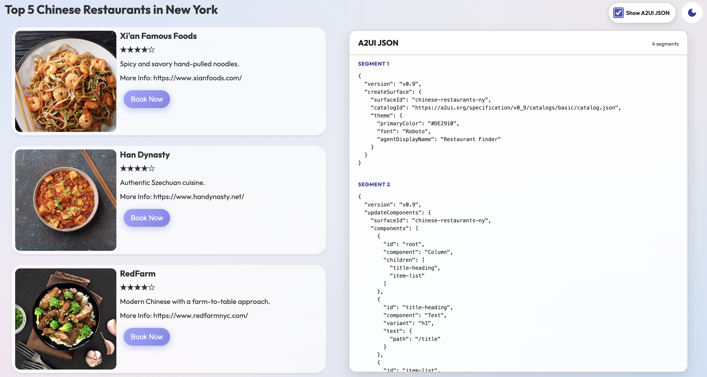
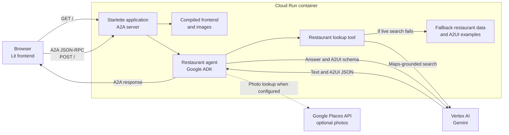

# Restaurant Finder Cloud Run deployment

This directory contains the complete Restaurant Finder deployment. It includes the Lit frontend source and compiled assets, the Python A2A agent, the A2UI Python SDK code used by the agent, and the Cloud Run build files. Building and deploying do not read files outside this directory.

## Screenshots

<p align="center">
  
  
  
</p>

## How the app and agent work

The container runs one Python process on the port assigned by Cloud Run. Its Starlette application handles the A2A routes and serves the compiled Lit frontend and restaurant images. Keeping both parts on one origin lets the browser call the agent without a separate API host or CORS configuration.



1. The browser loads the compiled Lit application from `/`.
2. The frontend reads `/.well-known/agent-card.json` to discover the agent URL and its supported A2UI extensions. The card uses the same canonical Cloud Run URL as the page.
3. A user message is sent to `/` as an A2A JSON-RPC request. The request identifies the A2UI protocol version supported by the frontend.
4. The A2A request handler passes the message to the restaurant agent. Its restaurant lookup tool asks Gemini for current results using Google Maps grounding.
5. If the grounded lookup fails or returns no results, the tool uses the bundled New York restaurant data. The fallback data includes Chinese and Mexican restaurants and is filtered by cuisine.
6. The lookup tool normalizes links and selects a local restaurant image or a cuisine-specific Unsplash image. When a Google Places API key is available, the completed A2UI response can replace those images with Places photos.
7. Gemini generates the answer and the A2UI JSON that describes the interface. The bundled A2UI SDK validates and converts that output into A2A response parts.
8. The Lit client reads those parts and renders the returned components. Later form actions are sent through the same A2A route so the agent can continue the interaction.

The client uses streaming by default. A2UI segments can reach the browser before the optional Places photo postprocessor runs, so Places photo replacements apply only when the modified final response is sent to the client. Local and Unsplash image selection happens inside the lookup tool and works in streaming responses.

Sessions, memory, artifacts, and A2A tasks are stored in memory inside each container instance. They are cleared when an instance stops, and they are not shared between instances.

## Configure the deployment

Copy the sample environment file before building or deploying:

```bash
cp .env.example .env
```

Edit `.env` to select the Google Cloud project, Cloud Run service and region, Vertex AI location, model, memory, and local Docker image name. Both `build.sh` and `deploy.sh` load this file automatically. Values in the file take precedence over inherited shell variables. Set `ENV_FILE` to use a file at another path.

### Configuration for live restaurant lookup

The Maps-grounded restaurant lookup uses the existing `GOOGLE_CLOUD_PROJECT`, `GOOGLE_CLOUD_LOCATION`, and `MODEL_NAME` settings. No new environment variable is required when the application already runs with Vertex AI and the Cloud Run runtime identity.

Live Google Places photos are optional. To try them locally, add a Google Places API key to `.env`:

```bash
GOOGLE_PLACES_API_KEY=your-google-places-api-key
```

The key must be authorized for the Google Places API used by the application. Restrict the key to the required API and deployment environment.

When `GOOGLE_PLACES_API_KEY` is set in the shell or `.env`, `deploy.sh` passes it to Cloud Run. If it is absent, the deployment continues to use the local and Unsplash image fallbacks. Passing the key this way stores it as a Cloud Run environment variable. For production deployments, store the key in Secret Manager and expose the secret to the service as `GOOGLE_PLACES_API_KEY`.

## A2UI learning scripts

Two scripts in the project root demonstrate the A2UI parsing and validation flow without running the frontend:

* `learn_a2ui.py` parses one invalid and one valid A2UI response and checks both against the bundled schema.
* `learn_a2ui_gemini.py` builds an A2UI system prompt, asks Gemini to generate a reservation interface, and validates the returned A2UI messages.

Install `uv`, then run the scripts from the project root with the bundled requirements:

```bash
uv run --with-requirements requirements.txt learn_a2ui.py
uv run --with-requirements requirements.txt learn_a2ui_gemini.py
```

The Gemini example uses the credentials loaded from `.env`. These learning scripts are not copied into the Cloud Run image.

## Frontend source

The editable Lit application is in `frontend-src/`. Its A2UI renderer dependencies are vendored under `frontend-src/vendor/`, so the build does not use the parent A2UI checkout or a private package registry. The generated static files are written to `frontend/`, which the Python server includes in the container.

Install Node.js 20 or newer, then build only the frontend with:

```bash
./build-frontend.sh
```

The script uses Corepack and the checked-in Yarn lockfile. It installs the exact dependency versions and replaces the contents of `frontend/` with a production Vite build.

## Build locally

Node.js 20 or newer and Docker are required for a local build.

```bash
./build.sh
```

The script rebuilds the frontend before creating the container image. The image name comes from `.env`. To build with a different configuration file, set `ENV_FILE`:

```bash
ENV_FILE=/path/to/test.env ./build.sh
```

## Deploy to Cloud Run

Install Node.js 20 or newer and the Google Cloud CLI, authenticate it, and run:

```bash
./deploy.sh
```

The deploy script rebuilds the frontend before it submits the minimal runtime files to Cloud Build.

The sample `.env.example` uses:

* Project: `xxx`
* Service: `restaurant-finder`
* Cloud Run region: `us-central1`
* Vertex AI location: `global`
* Model: `gemini-3-flash-preview`
* Memory: `1Gi`

To deploy with a different configuration file, set `ENV_FILE`:

```bash
ENV_FILE=/path/to/production.env ./deploy.sh
```

The deployment uses Vertex AI and the Cloud Run runtime identity by default. To use a Gemini API key stored in Secret Manager, provide the existing secret's name:

```bash
GEMINI_API_KEY_SECRET=my-gemini-key ./deploy.sh
```

The service is public because the frontend calls the A2A endpoint directly. The agent stores sessions and tasks in memory, so they are lost when an instance stops or traffic moves to another instance.
